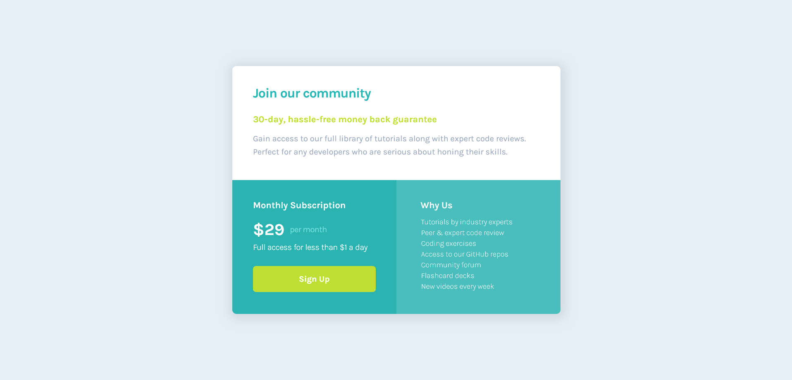

# Frontend Mentor - Single price grid component solution

This is a solution to the [Single price grid component challenge on Frontend Mentor](https://www.frontendmentor.io/challenges/single-price-grid-component-5ce41129d0ff452fec5abbbc). Frontend Mentor challenges help you improve your coding skills by building realistic projects. 

## Table of contents

  - [The challenge](#the-challenge)
  - [Screenshot](#screenshot)
  - [Links](#links)
  - [Built with](#built-with)
  - [Useful resources](#useful-resources)
- [Author](#author)

### The challenge

Users should be able to:

- View the optimal layout for the component depending on their device's screen size

### Screenshot

### Links

- Live Site URL: [Add live site URL here](https://domenicaperez000.github.io/singlepricegrid.github.io/)

### Built with

- Semantic HTML5 markup
- CSS custom properties
- Flexbox
- CSS Grid
- Javascript

### Useful resources

- [Kevin Powell's channel](https://www.youtube.com/@KevinPowell) - I know i have a lot to keep getting better at but this guys videos has helped me a lot!

## Author

- Website - [Domenica Perez](https://www.linkedin.com/in/domenica-perez-cabrera-00326a183/)
- Frontend Mentor - [@domeniceperez000](https://www.frontendmentor.io/profile/domenicaperez000)

